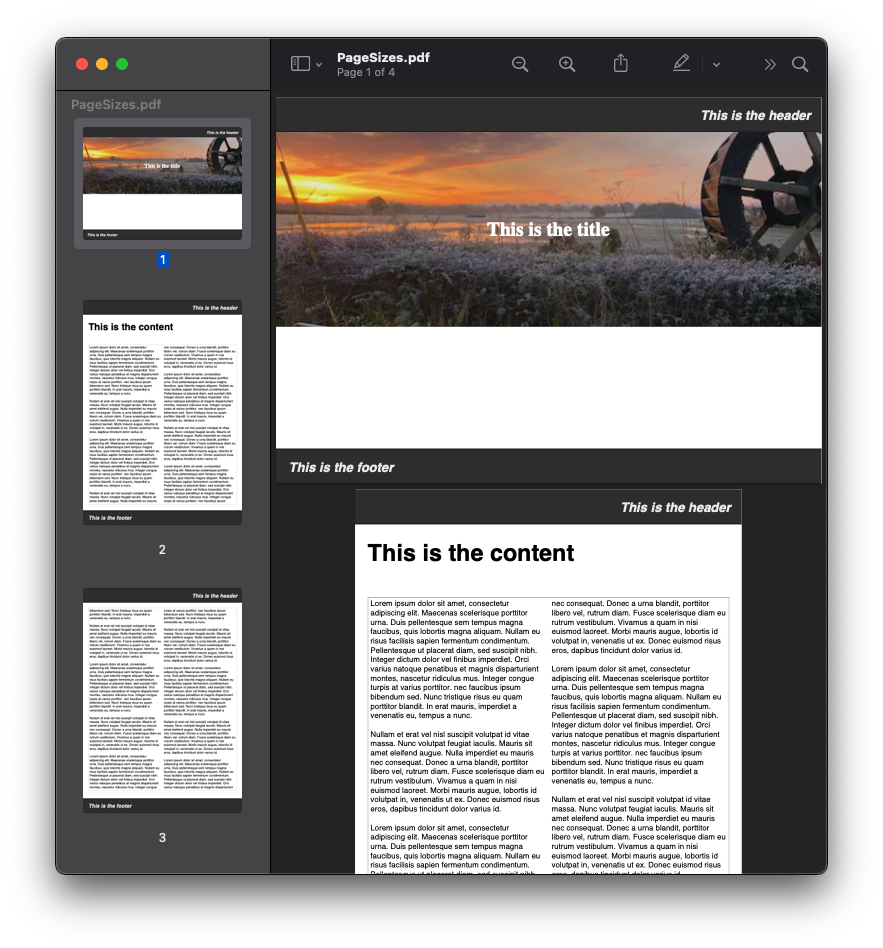
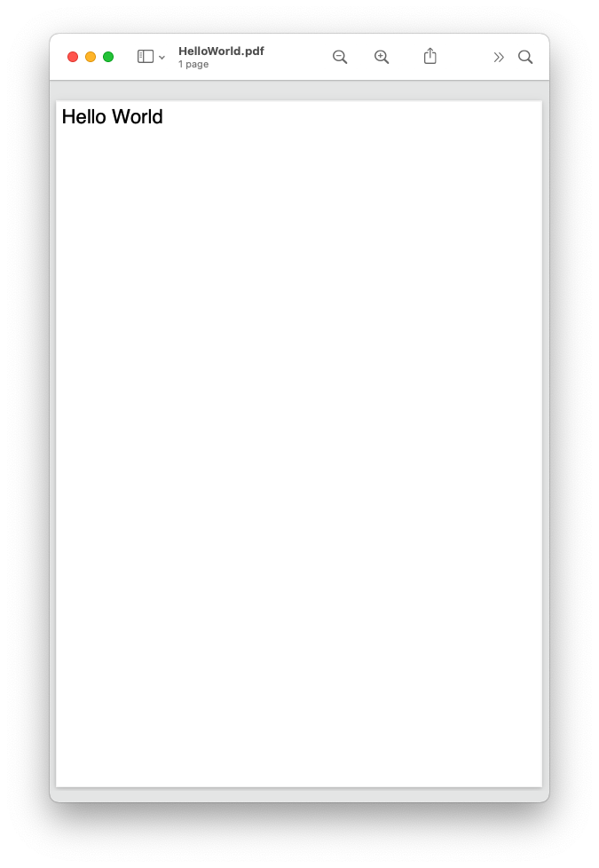

=============
Scryber 5.1
=============

Data driven, good looking, documents from templates
-----------------------------------------------------

Scryber is **the** engine to create dynamic PDF documents quickly and easily from XHTML templates with consistant styles, your own data, and an easy flowing layout.
It's open source; flexible; styles based; data driven and with a low learning curve. 

Written entirely in C# for dotnet 5 using HTML, CSS and SVG.

Documentation for the 5.0.x versions is here `5.0.6 Read the docs here <https://scrybercore.readthedocs.io/en/v5.0.6-package-release/>`_
Documentation for previous 1.0.x pdfx versions for `1.0.0 Read the docs here <https://scrybercore.readthedocs.io/en/v1.0.0.20-beta/>`_

Hello World MVC
-----------------

Download the nuget package

`<https://www.nuget.org/packages/Scryber.Core.Mvc>`_

Start with a template. **The xmlns namespace declaration is important.**

.. code-block:: html

    <!DOCTYPE HTML >
    <html lang='en' xmlns='http://www.w3.org/1999/xhtml' >
        <head>
            <title>{{hello}}</title>
        </head>
        <body>
            
{{hello}}.

        </body>
    </html>

And then generate your template in a view.

.. code-block:: csharp

    //add the namespaces
    using Scryber.Components;
    using Scryber.Components.Mvc;
    using Microsoft.AspNetCore.Mvc;

    public class HomeController : Controller
    {
        
        private readonly IWebHostEnvironment _env;
        
        public HomeController(IWebHostEnvironment environment)
        {
            _env = environment;
        }

        [HttpGet]
        public IActionResult HelloWorld()
        {
            // get the path to where you have saved your template 
            var path = _env.ContentRootPath;
            path = System.IO.Path.Combine(path, "Views", "PDF", "HelloWorld.html");

            //parsing the document creates a complete object graph from the content
            using(var doc = Document.ParseDocument(path))
            {
                doc.Params["hello"] = "Hello World";
                return this.PDF(doc); //convenience extension method to return the result.
            }
        }

    }

Getting Started
-----------------

Check out :doc:`1_overview/2_mvc_controller_full` for a full MVC example with styles and binding.
Or :doc:`1_overview/1_gui_controller_full` for a full gui application example (with styles and binding)

.. toctree::
    :maxdepth: 1
    :caption: Scryber Overview

    1_overview/1_gui_controller_full
    1_overview/2_mvc_controller_full
    1_overview/3_what_is_scryber
    1_overview/4_packages_and_libs
    1_overview/5_samples_reference
    1_overview/6_scryber_parsing
    1_overview/7_parameters_and_expressions
    1_overview/8_styles_and_classes
    1_overview/9_document_output
    version_history

Easy, and intuitive structure
------------------------------

Whether you are using xhtml templates or directly in code, scryber
is quick and easy to build complex documents from your designs and data using standard xhtml.

.. toctree::
    :caption: Document features
    :maxdepth: 1

    2_document/1_document_overview
    2_document/2_document_structure
    2_document/3_drawing_units
    2_document/4_drawing_colors
    2_document/5_drawing_fonts
    2_document/6_document_header
    2_document/7_document_security
    2_document/8_scryber_processing
    2_document/9_document_logging
    2_document/10_document_outline
    2_document/11_scryber_classes
    2_document/12_document_code_vs_xml
    2_document/13_document_lifecycle
    2_document/14_document_references

Intelligent flowing layout engine
----------------------------------

In scryber, content can either be laid out explicitly, or jut flowing with the the page.
It supports many of the standard html elements that allow you to build complex documents
with ease.

.. toctree:: 
    :caption: Building components
    :maxdepth: 1
    :hidden:

    3_components/1_component_reference
    3_components/2_pages_reference
    3_components/3_pagenumbering_reference
    3_components/4_panels_reference
    3_components/5_headings_reference
    3_components/6_lists_reference
    3_components/7_tables_reference
    3_components/8_other_block_reference
    3_components/9_other_inline_reference
    3_components/10_images_reference
    3_components/11_links_reference
    3_components/12_numbers_reference
    3_components/13_page_headers_reference
    3_components/14_embed_reference
    3_components/15_template_reference
    3_components/16_pre_reference

Cascading Styles 
-----------------

With a styles based structure, it's easy to apply designs to templates. Use class names, id's or component types,
or nested selectors.

You can add inline styles, add css classes or reference stylesheets, even import your Google fonts.

**Now including css calc() and var() support**

.. toctree:: 
    :caption: Styling content
    :maxdepth: 1

    4_styles/1_document_styles
    4_styles/2_link_stylesheet_references
    4_styles/3_columns_reference
    4_styles/4_text_alignment_reference
    4_styles/5_other_alignment_reference
    4_styles/6_size_reference
    4_styles/7_position_reference
    4_styles/8_stroke_reference
    4_styles/9_borders_reference
    4_styles/10_fills_reference
    4_styles/11_background_reference
    4_styles/12_img_background_reference
    4_styles/13_gradients_reference
    4_styles/14_text_spacing_reference
    4_styles/15_fonts_reference
    4_styles/16_media_reference
    4_styles/17_page_size_reference
    4_styles/18_unsupported_reference

Drawing and Typographic support
--------------------------------

Scryber supports inclusion of Images, Fonts (inc. Google fonts) and SVG components for drawing graphics and icons.

.. toctree:: 
    :caption: Drawing and Shapes
    :maxdepth: 1

    5_shapes/1_drawing_paths
    5_shapes/2_styles_reference
    5_shapes/3_lines_reference
    5_shapes/4_rects_reference
    5_shapes/5_circles_reference
    5_shapes/6_paths_reference
    5_shapes/7_text_reference
    5_shapes/8_viewport_reference
    5_shapes/9_groups_defns_reference
    5_shapes/10_unsupported

Binding to your data
---------------------

With a simple handlebars binding notation it's easy to add references to your data structures and pass information
and complex data to your document from your model and more.

**Now supporting full expressions support**

.. toctree:: 
    :caption: Binding model
    :maxdepth: 1

    6_binding/1_binding_model
    6_binding/2_handlebars_reference
    6_binding/3_bindable_properties_reference
    6_binding/4_css_calc_reference
    6_binding/5_binding_choices
    6_binding/6_functions_reference
    6_binding/7_operator_reference
    6_binding/8_comparison_function_reference
    6_binding/9_math_function_reference
    6_binding/10_string_function_reference
    6_binding/11_date_function_reference
    6_binding/12_conversion_function_reference
    6_binding/13_param_dictionary_reference
    6_binding/14_document_events
    6_binding/15_document_controllers
    6_binding/16_binding_performance

Extensible Framework
-----------------------

Scryber was designed from the ground up to be extensible. If it doesn't do what you need, then we think you can make it do it.
With iFrame includes, a namespace based parser engine, and configuration options for images, fonts, binding it's down to your imagination

.. toctree::
    :caption: Extending Scryber
    :maxdepth: 1

    7_extending/1_extending_scryber
    7_extending/2_extending_components
    7_extending/3_extending_component_example
    7_extending/4_extending_configuration
    7_extending/5_extending_images
    7_extending/6_extending_security
    7_extending/7_extending_functions
    7_extending/8_key_namespaces
    7_extending/9_namespaces_and_assemblies
    7_extending/10_binding_parameters

Secure and Encrypted
-----------------------

Scryber fully supports the PDF restrictions and both 40 bit and 128 bit encryption of documents using owner and user passwords.

:doc:`2_document/7_document_security`

