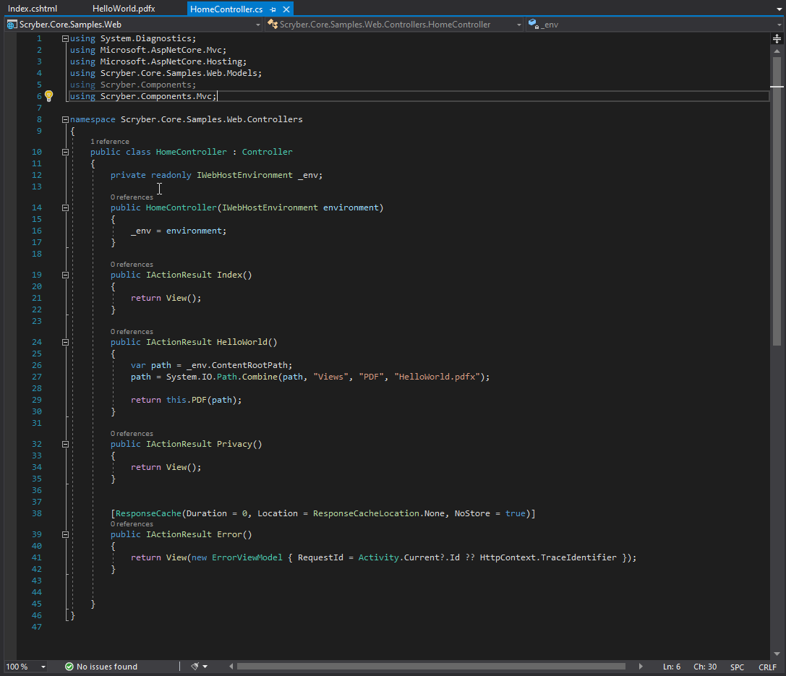
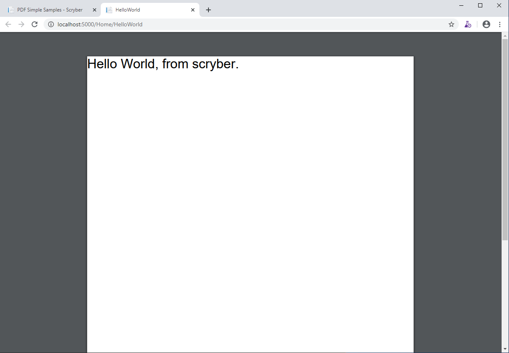

================================
MVC Controller - Getting Started
================================

A Complete example for creating a hellow world PDF file from an MVC Controller in C#

Nuget Packages
==============

Make sure you install the Nuget Packages

`<https://www.nuget.org/packages/Scryber.Core.Mvc>`_

This will add the latest version of the Scryber.Core nuget package, and the Scryber.Core.Mvc extension methods.

Add the XML Schema files to help with the intellisense

`<https://www.nuget.org/packages/Scryber.Core.Schemas/>`_

Add a document template
=======================

In our applications we like to add our templates to a PDF folder the Views folder. You can break it down however works for you, but for a create a new XML file called HelloWorld.pdfx in your folder.

And paste the following content into the file

.. code-block:: html

    <?xml version="1.0" encoding="UTF-8" ?>
    <pdf:Document xmlns:pdf="http://www.scryber.co.uk/schemas/core/release/v1/Scryber.Components.xsd"
              xmlns:styles="http://www.scryber.co.uk/schemas/core/release/v1/Scryber.Styles.xsd"
              xmlns:data="http://www.scryber.co.uk/schemas/core/release/v1/Scryber.Data.xsd">
        <Pages>
            <pdf:Page>
                <Content>
                    <pdf:Label>Hello World, from scryber.</pdf:Label>
                </Content>
        </pdf:Page>
        </Pages>
    </pdf:Document>

Your solution should look something like this.

.. image:: images/initialhelloworld.png

For for more information on the namespaces and mappings see this [About Namespaces](namespaces-and-assemblies) documentation

Controller code
===============

Add a new controller to your project, and a couple of namespaces are important to add to the top of your controller.

.. code-block:: csharp

    using Scryber.Components;
    using Scryber.Components.Mvc;

Add the Web host service
========================

In order to nicely reference files in your view, add a reference to the IWebHostEnvironment to your home controller constructor.

.. code-block:: csharp

    private readonly IWebHostEnvironment _env;
            
    public HomeController(IWebHostEnvironment environment)
    {
        _env = environment;
    }

Add a Controller Method
=======================

Next add a new Controller Method to your class for retrieve and generate

.. code-block:: csharp

    public IActionResult HelloWorld()
    {
        var path = _env.ContentRootPath;
        path = System.IO.Path.Combine(path, "Views", "PDF", "HelloWorld.pdfx");

        return this.PDF(path);
    }

The PDF externsion method will read the PDF template from the path and generate the file to the response.

Testing your action
===================

To create your pdf simply add a link to your action method in a view.

.. code-block:: html

    

        <h2 class="display-4">Simple sample from the PDF Controller</h2>
        <ul>
            <li><a href='@Url.Action("HelloWorld","Home")' target='_blank'>Hello World PDF</a></li>
        </ul>
        
    

Running your application, you should see the link and clicking on it will open the pdf in a new tab or window.

Further reading
===============

You can read more about what you can do with scryber here

* :doc:`document_model`
* :doc:`document_structure`
* :doc:`component_types`
* :doc:`document_styles`
* :doc:`referencing_files`