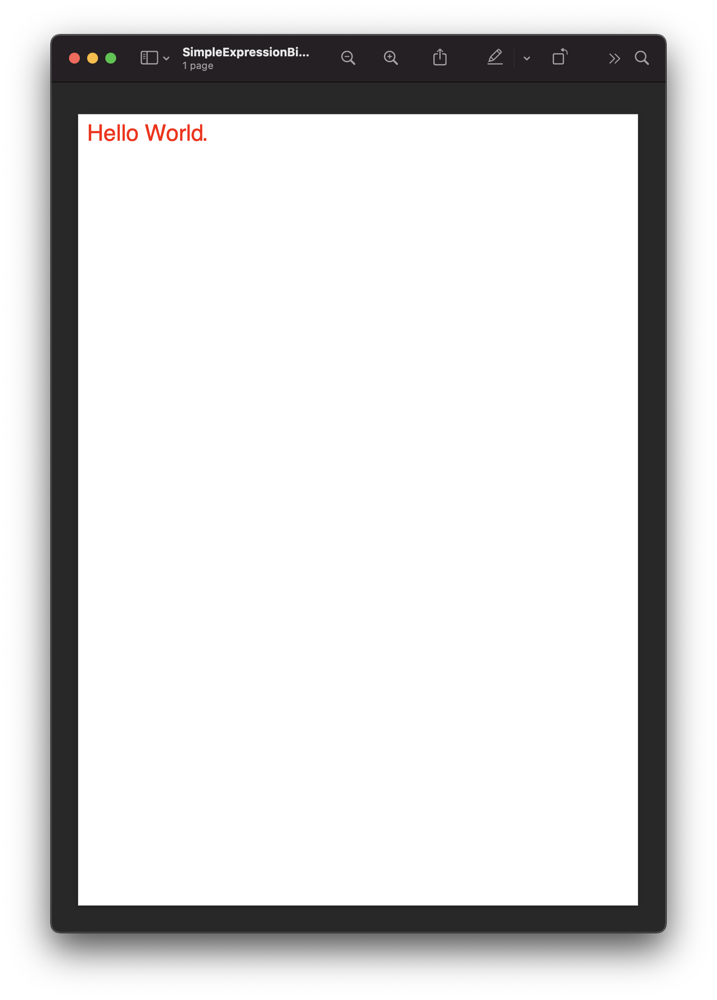

=====================================
Document parameters and expressions
=====================================

Within the content of a document the parser will look for expressions that will be evaluated at binding time into actual values.
Every attribute in scryber, and all text can be bound with an expression.

The usual method for specifying these values uses the handlebars syntax - ``{{ expression }}``

This allows the inclusion of dynamic content at runtime either for specific values or for binding onto repeating content.

The values are passed to the document through the ``Params`` property of a document instance.

.. code:: html

    <!DOCTYPE HTML >
    <html lang='en' xmlns='http://www.w3.org/1999/xhtml' >
        <head>
            <title>{{title}}</title>
        </head>
        <body>
            
{{title}}.

        </body>
    </html>

When processing the document, the values for ``title`` and ``color`` can be provided.

.. code:: csharp

    var doc = Document.ParseDocument("MyFile.html");

    doc.Params["title"] = "Hello World";
    doc.Params["color"] = "#FF0000";
    doc.Params["space"] = "10pt";

    //Before databinding - value is not set
    Assert.IsTrue(string.IsNullOrEmpty(doc.Info.Title));

    doc.SaveAsPDF("OutputPath.pdf");

    //After databinding
    Assert.AreEqual("Hello World", doc.Info.Title);

At generation time these values will be interpeted and set on the appropriate properties and rendered to the file.
As the layout has not executed before the databind, the content will be flowed with the rest of the document.

`Full size version <../_images/doc_simple_binding.png>`_

.. note:: Scryber is strongly typed. It will try and convert or parse the values on databinding, and most of the style values and propoerties can be parsed. But tehe content should be of the correct type.

Binding to complex types and expressions
-----------------------------------------

This is good, but as you can imagine the parameters could get unmanageable and complex.
Thankfully the support for expressions allows both interrogation and calculation.

It is possible to use both strongly typed or dynamic objects (or a combination of both) for parameters.

.. code:: html

    <!DOCTYPE HTML >
    <html lang='en' xmlns='http://www.w3.org/1999/xhtml' >
        <head>
            <title>{{concat('Hello ', model.user.firstname)}}</title>
        </head>
        <body>
            
{{concat('Hello ',model.user.firstname)}}.

        </body>
    </html>

.. code:: csharp

    var doc = Document.ParseDocument("MyFile.html");

    doc.Params["model"] = new { 
                                user = new { firstname = "Richard", 
                                             salutation = "Mr" }
                          };
    doc.Params["theme"] = new {
                                color = "#FF0000",
                                space = "10pt",
                                align = "center"
                          };

    doc.SaveAsPDF("OutputPath.pdf");

The bindings will now be evaluated against the ``theme`` and ``model`` complex objects to get the right value.

`Full size version <../_images/doc_simple_binding.png>`_

.. note:: The styling for the div is becomming quite long and complex. In the next section we will go through the options for css styles along with var() and calc().

