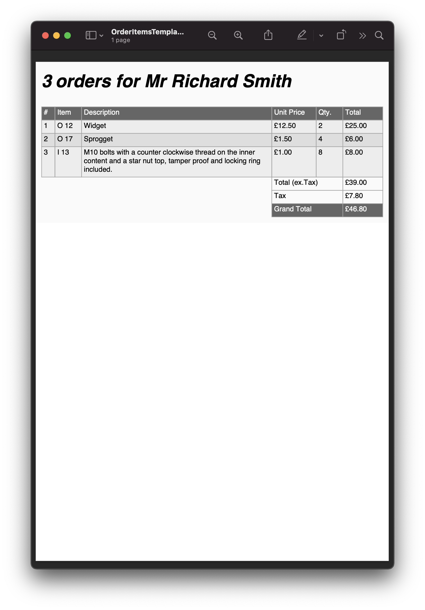

=====================================
Document parameters and expressions
=====================================

Within the content of a document the parser will look for expressions that will be evaluated at binding time into actual values.
Every attribute in scryber, and all text can be bound with an expression.

The usual method for specifying these values uses the handlebars syntax - ``{{ expression }}``

This allows the inclusion of dynamic content at runtime either for specific values or for binding onto repeating content.

The values are passed to the document through the ``Params`` property of a document instance.

.. code:: html

    <!DOCTYPE HTML >
    <html lang='en' xmlns='http://www.w3.org/1999/xhtml' >
        <head>
            <title>{{title}}</title>
        </head>
        <body>
            
{{title}}.

        </body>
    </html>

When processing the document, the values for ``title`` and ``color`` can be provided.

.. code:: csharp

    var doc = Document.ParseDocument("MyFile.html");

    doc.Params["title"] = "Hello World";
    doc.Params["color"] = "#FF0000";
    doc.Params["space"] = "10pt";

    //Before databinding - value is not set
    Assert.IsNull(doc.Info.Title);

    doc.SaveAsPDF("OutputPath.pdf");

    //After databinding
    Assert.AreEqual("Hello World", doc.Info.Title);

At generation time these values will be interpeted and set on the appropriate properties and rendered to the file.
As the layout has not executed before the databind, the content will be flowed with the rest of the document.

.. figure:: ../images/doc_simple_binding.png
    :target: ../_images/doc_simple_binding.png
    :alt: Binding simple content for documents
    :width: 600px
    :class: with-shadow

`Full size version <../_images/doc_simple_binding.png>`_

.. note:: Scryber is strongly typed. It will try and convert or parse the values on databinding, and most of the style values and propoerties can be parsed. But tehe content should be of the correct type.

Binding to complex types and expressions
-----------------------------------------

As you can imagine the parameters could start to get unmanageable and complex.
Thankfully the support for expressions allows both interrogation and calculation.

It is possible to use both strongly typed or dynamic objects (or a combination of both) for parameters.

.. code:: html

    <!DOCTYPE HTML >
    <html lang='en' xmlns='http://www.w3.org/1999/xhtml' >
        <head>
            <title>{{concat('Hello ', model.user.firstname)}}</title>
        </head>
        <body>
            
{{concat('Hello ',model.user.firstname)}}.

        </body>
    </html>

.. code:: csharp

    var doc = Document.ParseDocument("MyFile.html");

    doc.Params["model"] = new { 
                                user = new { firstname = "Richard", 
                                             salutation = "Mr" }
                          };
    doc.Params["theme"] = new {
                                color = "#FF0000",
                                space = "10pt",
                                align = "center"
                          };

    doc.SaveAsPDF("OutputPath.pdf");

The bindings will now be evaluated against the ``theme`` and ``model`` complex objects to get the right value.

.. figure:: ../images/doc_expression_binding.png
    :target: ../_images/doc_expression_binding.png
    :alt: Binding complex content for documents
    :width: 600px
    :class: with-shadow

`Full size version <../_images/doc_expression_binding.png>`_

.. note:: The styling for the div is becomming quite long and complex. In the next section we will go through the options for css classes along with var() and calc().

Looping over collections
-------------------------

Along with the interrogation of the object properties scryber supports the use of the indexor properties, and also enumeration over collections and a current data context.

.. code:: html

    <!DOCTYPE HTML>
    <html lang='en' xmlns='http://www.w3.org/1999/xhtml'>
    <head>
        <title>{{concat('Orders for ', model.user.firstname)}}</title>
    </head>
    <body>
        

            

                <h2>{{count(model.order.items)}} orders for {{join(' ', model.user.salutation, model.user.firstname, model.user.lastname)}}</h2>
            

            

                <table style='width:100%'>
                    <thead>
                        <tr style='background-color: #666; color: #FFF'>
                            <td style='width:30px'>#</td>
                            <td style='width:60px'>Item</td>
                            <td>Description</td>
                            <td style='width:100px'>Unit Price</td>
                            <td style='width:60px'>Qty.</td>
                            <td style='width:90px'>Total</td>
                        </tr>
                    </thead>
                    <tbody>
                        <template data-bind='{{model.order.items}}'>
                            <tr style='background-color: {{if(index() % 2 == 1, "#DDD","#EEE")}}'>
                                <td>{{index() + 1}}</td>
                                <td>{{.itemNo}}</td>
                                <td>{{.name}}</td>
                                <td><num value='{{.price}}' data-format='{{model.order.currencyFormat}}' /></td>
                                <td>{{.qty}}</td>
                                <td>
                                    <num value='{{.price * .qty}}' data-format='{{model.order.currencyFormat}}' />
                                </td>
                            </tr>
                        </template>
                    </tbody>
                    <tfoot>
                        <tr>
                            <td colspan='3' style="border:none;"></td>
                            <td colspan='2'>Total (ex.Tax)</td>
                            <td>
                                <num value='{{model.order.total}}' data-format='{{model.order.currencyFormat}}' />
                            </td>
                        </tr>
                        <tr>
                            <td colspan='3' style="border:none;"></td>
                            <td colspan='2'>Tax</td>
                            <td>
                                <num value='{{model.order.total * model.order.taxRate}}' data-format='{{model.order.currencyFormat}}' />
                            </td>
                        </tr>
                        <tr>
                            <td colspan='3' style="border:none;"></td>
                            <td colspan='2' style='background-color: #666; color: #FFF'>Grand Total</td>
                            <td style='background-color: #666; color: #FFF'>
                                <num value='{{(model.order.total * model.order.taxRate) + model.order.total}}' data-format='{{model.order.currencyFormat}}' />
                            </td>
                        </tr>
                    </tfoot>
                </table>
            

        

    </body>
    </html>

.. code:: csharp

    var doc = Document.ParseDocument("MyFile.html");

    doc.Params["model"] = new {
                user = new
                {
                    lastname = "Smith",
                    firstname = "Richard",
                    salutation = "Mr"
                },
                order = new
                {
                    items = new[] {
                        new { itemNo = "O 12", name = "Widget", qty = 2, price = 12.5 },
                        new { itemNo = "O 17", name = "Sprogget", qty = 4, price = 1.5 },
                        new { itemNo = "I 13", name = "M10 bolts with a counter clockwise thread on the inner content and a star nut top, tamper proof and locking ring included.", qty = 8, price = 1.0 },
                    },
                    currencyFormat = "£##0.00",
                    taxRate = 0.2,
                    total = 39.0
                }
    };

    doc.Params["theme"] = new {
                                color = "#FAFAFA",
                                space = "10pt",
                                align = "center"
                          };

    doc.SaveAsPDF("OutputPath.pdf");

`Full size version <../_images/doc_sexpression_ordertemplate.png>`_

There is a lot going on here, but...

* The heading is counting the number of order items and joining some strings together
* The table head is setting the widths of the columns that the content flows into.
* The table body has a ``template`` and is looping over the ``model.order.items`` collection, and creating a row for each of the items.
* The ``index()`` function is returning the *zero-based* index in the collection.
* The ``if(calc, true, false)`` function is setting the style for alternate rows.
* Inside the template row we are referring to the current item with the dot prefix.
* The I 13 item has a long desciption that is flowing across multiple line in the cell.
* The ``footer`` rows are performing some calculations based on the summary information, and outputting the total values.
* The ``num @data-format`` is changing the output text to a currency value within the model.

The template will work on any collection, or an individual item as a *with* expression.

Dynamically showing and hiding content
---------------------------------------

Calculations in expressions
---------------------------