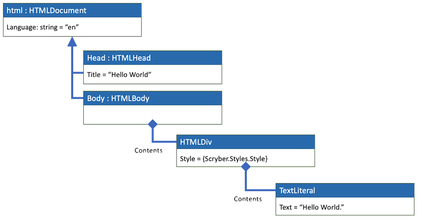

================================
Parsing documents from content
================================

When you parse the contents of an file, or a stream or a reader, Scryber builds a full object model of the content.
As the parser is based around XML it is important that all content is valid - it does not like unclosed tags or elements.

Content namespaces
-------------------

As the most basic example

.. code:: html

    <!DOCTYPE HTML >
    <html lang='en' xmlns='http://www.w3.org/1999/xhtml' >
        <head>
            <title>Hello World</title>
        </head>
        <body>
            
Hello World.

        </body>
    </html>

Would be parsed into the following Document Object Model

`Full size version <../_images/doc_object_model.png>`_

The namespace for an element must be known to the parser. For most XHTML templates this will be the standard XML Namespace (xmlns)  http://www.w3.org/1999/xhtml
This namespace is mapped directly onto the library assembly and namespace ``Scryber.Html.Components, Scryber.Components``

In the library there is a class called ``HTMLDocument`` that is decorated with the ``PDFParsableComponent`` attribute with a name of 'html'.
This is how the parser knows that when it sees an XML element called *html* it should create an instance of the ``Scryber.Html.Components.HTMLDocument`` class.

This class has a couple of properties on it for *Head* and *Body* that are decorated with the ``PDFElement`` attribute with names *head* and *body* respectively. 
So the parser knows when it reads elements with this name, the values should be set as instances of the classes ``HTMLHead`` and ``HTMLBody``.

It also has an attribute for the *lang* value that will be set.

.. code:: csharp

    namespace Scryber.Html.Components
    {
        [PDFParsableComponent("html")]
        public class HTMLDocument : Document
        {
            [PDFElement("head")]
            public HTMLHead Head
            {
                get;
                set;
            }

            [PDFElement("body")]
            public HTMLBody Body
            {
                get ;
                set ;
            }

            [PDFAttribute("lang")]
            public string Language
            {
                get;
                set;
            }

            .
            .
            .
        }
    }

And so it goes on into the rest of the xml, reading elements and attributes, and trying to set the values to components or property values.

Parsing Documents
-----------------

The easiest way to parse any xml content is to use the various static methods on the ``Scryber.Components.Document`` class.

There are 2 variants called ``ParseDocument`` and ``Parse``. 

``ParseDocument`` has 6 overloads and the content parsed must have a root object that is (or inherits from) ``Scryber.Components.Document``
The simplest is to load directly from a file

.. code:: csharp

    //using Scryber.components

    string filepath = GetPathToFile();
    var doc = Document.Parse(filepath);

This reads the file from the stream and will resolve any references to relative content (images, stylesheets, etc) based on the *filepath*.

If you want to load content dynamically from a stream then you can use the overloads that take a stream.
An enumeration value for ParseSourceType must be provided, and an optional path value, so the parser can know where other references may reside.

.. code:: csharp

    //from a stream with no references
    using(var content = GetMyDocumentContent())
    {
        doc = Document.ParseDocument(content, PaseSourceType.DynamicContent);
    }

If the stream will contain relative path references to other content such as stylesheets or embedded content then a path should be provided.
If no path is provided then content will be looked for relative to the current executing assembly. 

.. code:: csharp

    //from a stream where references are known to be stored
    var path = "C:/MyFiles/BasePath";
    using(var content = GetMyDocumentContent())
    {
        doc = Document.ParseDocument(content, path, PaseSourceType.DynamicContent);
    }

The options for the content can be any of the following.

* A ``System.IO.Stream`` or one of its sublcasses.
* A ``System.IO.TextReader`` or one of its subclasses.
* A ``System.XML.XmlReader`` or one of its subclasses.

Ultimately the content should be valid XML that can be read.

For example, using an XmlReader

.. code:: csharp

    XNamespace ns = "http://www.w3.org/1999/xhtml";

    var html = new XElement(ns + "html",
        new XElement(ns + "head",
            new XElement(ns + "title",
                new XText("Hello World"))
            ),
        new XElement(ns + "body",
            new XElement(ns + "div",
                new XAttribute("style", "padding:10px"),
                new XText("Hello World."))
            )
        );

    using(var reader = html.CreateReader())
    {
        //passing an empty string to the path as we don't have images or other references to load
        var doc = Document.ParseDocument(reader, string.Empty, ParseSourceType.DynamicContent);
    }

Or from a string itself

.. code:: csharp

    var title = "Hello World";
    var src = @"<html xmlns='http://www.w3.org/1999/xhtml' >
                    <head>
                        <title>" + title + @"</title>
                    </head>
                    <body>
                        
" + title + @".

                    </body>
                </html>";

    using (var reader = new StringReader(src))
    {
        var doc = Document.ParseDocument(reader, string.Empty, ParseSourceType.DynamicContent);
    }

Building documents in code
--------------------------

The template parsing engine is both flexible and extensible, but it does not have to be used.
Scryber components are **real** object classes, they have properties and methods along with inner collections.

We can just as easily create the document using a method.

.. code:: csharp

    //using Scryber.Components
    //using Scryber.Drawing

    protected Document GetHelloWorld()
    {
        var doc = new Document();
        doc.Info.Title = "Hello World";

        var page = new Page();
        doc.Pages.Add(page);

        var div = new Div() { Padding  = new PDFThickness(10) };
        page.Contents.Add(div);

        div.Contents.Add(new TextLiteral("Hello World"));

        return doc;
    }

This works well, and may have benefits for your implementations, but ultimately could become very complex and difficult to maintain.

Embedding content from other files
-----------------------------------

Including content from other sources (files) is easy within the template by using the ``<embed>`` element with the ``src`` attribute set to the name of the source file.
This can either be a relative or an absolute path to the content to be included.

.. code:: html

    

        <embed src='./fragments/tsandcs.html' />
    

The content will be loaded by the parser syncronously rather than at load time, which is the case for css stylesheets and images.
This is to ensure there is a full file content to be parsed.

The embedded content should be a fragment of valid xhtml / xml rather than a full html file.

.. code:: html

    <!-- Standard terms and conditions, with namespace -->
    

        
1. We will look after you

        
2. If you look after us

    

When loading with relative references, the original path to the source file will be used to resolve the location of the embedded source.
As with the examples above - if the content is being parsed dynamically, either the base path to the location sould be specified in the ``ParseDocument``
method, or a ``PDFReferenceResolver`` should be provided, as below.

Parsing and Reference Resolvers
--------------------------------

The ``Document.Parse`` method, and its 12 overloads allows for parsing of any xml content as long as the root component returned implements the ``IPDFComponent`` interface.

If there are references to other content, that needs to be resolved at runtime it is also possible to pass a ``PDFReferenceResolver`` delegate to the parser so that your
code can load it's own content and return it.

.. code:: csharp

    public delegate IPDFComponent PDFReferenceResolver(string filename, string xpath, PDFGeneratorSettings settings);

This delegate will be called each time a remote reference is found, with the name of the file, and an optional xpath selector. 
It is upto the implementor to perform the parsing.

For example if we wanted to embed some standard content we could provide our own implementation.

.. code:: csharp

    private IPDFComponent CustomResolve(string filepath, string xpath, PDFGeneratorSettings settings)
    {
        if(filepath == "MyTsAndCs")
        {
            using(var tsAndCs = LoadTermsStream())
            {
                //We have our stream so just do the parsing again with the same settings
                return Document.Parse(filepath, tsAndCs, ParseSourceType.DynamicContent, CustomResolve, settings);
            }
        }
        else
        {
            filepath = System.IO.Path.Combine(MyBasePath, filepath);
            return Document.Parse(filepath, CustomResolve, settings);
        }
    }

    private Document LoadDocument()
    {
        var src = @"<html xmlns='http://www.w3.org/1999/xhtml' >
                    <head>
                        <title>" + title + @"</title>
                        </head>
                    <body>
                        
" + title + @".

                        <embed id='TsAndCs' src='MyTsAndCs' />
                    </body>
                </html>";

        using (var reader = new StringReader(src))
        {
            //Execute the parsing with the custom resolver
            var doc = Document.Parse(string.Empty, reader, ParseSourceType.DynamicContent, CustomResolve);
        }
    }
    
.. note:: Remember, the content to be parsed MUST be valid XML. So the content returned from the LoadTermsStream() method should be valid xml in its own right, including all XML namespaces.

It is also possible to return just coded objects in the return of the reference resolver, and the ``PDFReferenceResolver`` delegate can be any instance.

.. code:: csharp

    //using Scryber.Components
    //using Scryber.Drawing

    private IPDFComponent CustomResolve(string filepath, string xpath, PDFGeneratorSettings settings)
    {
        if(filepath == "MyTsAndCs")
        {
            var  p = new Paragraph(){ BackgroundColor = PDFColors.Aqua };
            p.Contents.Add(new PDFTextLiteral("These are my terms"));
            return p;
        }
        else
        {
            filepath = System.IO.Path.Combine(MyBasePath, filepath);
            return Document.Parse(filepath, CustomResolve, settings);
        }
    }

see :doc:`document_code_vs_xml` for more information.

Extending namespaces
---------------------

The scryber parsing engine is declarative and does not rely on knowing what it is meant to be parsing.
As such it is easy to extend the namespaces it looks at to build object graphs (in fact the html and svg classes are built directly on top of the base component classes).

See :doc:`../namespaces_and_assemblies` for more information on how to extend the namespaces and used by the parser.